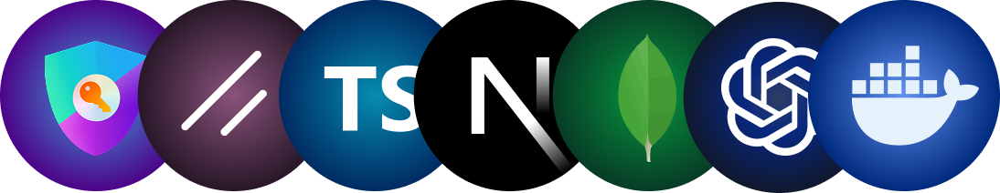
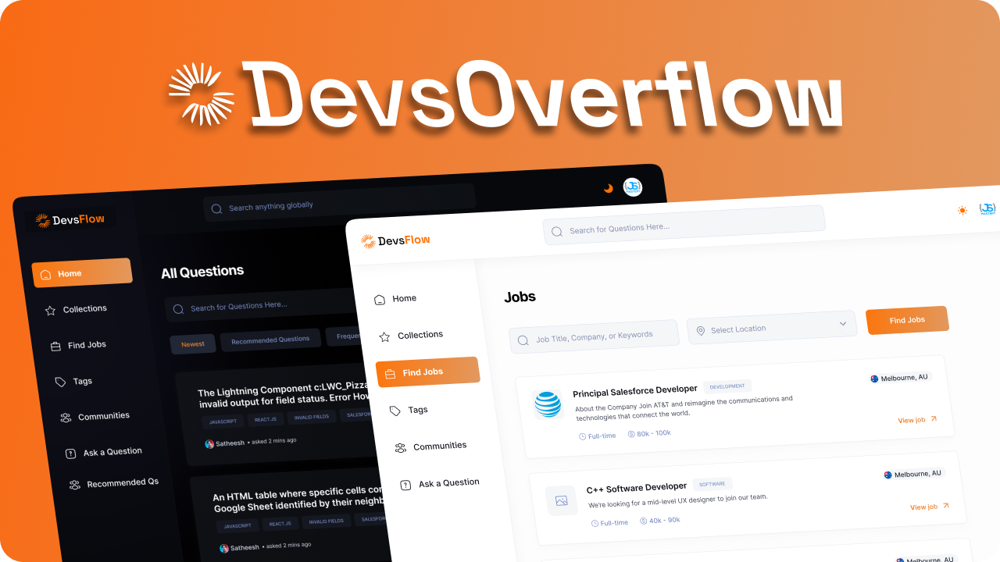

<h1 align="center">Devs Overflow</h1>

<p align="center">
Ask, answer and accelerate your developer journey.
</p>

<p align=center>
  
<p>

<div align= "center">

[](https://twitter.com/yntpdotme)&nbsp;&nbsp;[](https://www.linkedin.com/in/yntpdotme/)&nbsp;&nbsp;[](mailto:hello@yntp.me)
&nbsp;[](https://conventionalcommits.org)&nbsp; [](https://choosealicense.com/licenses/mit/)

</div>

</div>

<h2 align="center">

 &nbsp;[See it in Action](https://devs-overflow.vercel.app) &nbsp;»

</h2>

<br>

<p align="center">
  <a href="#introduction"><strong>Introduction</strong></a> 
	·&nbsp;<a href="#features"><strong>Features</strong></a> 
	·&nbsp;<a href="#tech-stack"><strong>Tech Stack</strong></a>
	·&nbsp;<a href="#local-development"><strong>Development Setup</strong></a> 
	·&nbsp;<a href="#local-development"><strong>Contributing</strong></a> 
</p>

<br>

## <a name="introduction">❄️&nbsp;Introduction</a>

Devs-Overflow is a modern, AI-powered Q&A platform built for developers. It combines the power of community knowledge with intelligent solutions to help developers find answers, share expertise, and grow together. Delve into the codebase to explore more.

<br>

<a href="https://devs-overflow.vercel.app/">
  <p align=center>
    
  <p>
</a>

<br>

## <a name="features">🔋&nbsp; Features</a>

- &nbsp;🚥&nbsp;&nbsp; Full-featured QnA Platform with voting, bookmarking, and view tracking

- &nbsp;🎬&nbsp;&nbsp; Personalized Recommendations System

- &nbsp;🏆&nbsp;&nbsp; Rewards & Badges on the basis of activity

- &nbsp;📝&nbsp;&nbsp; Rich Content Editor with MDX support for questions and answers

- &nbsp;🎚️&nbsp;&nbsp; Advanced filtering and sorting capabilities

- &nbsp;🗃️&nbsp;&nbsp; Organized File and Folder Structure

- &nbsp;📋&nbsp;&nbsp; Job Portal with filters and search, tailored to the user’s location.

- &nbsp;🔎&nbsp;&nbsp; Globally Search content across questions, users, tags, and more.

- &nbsp;🔑&nbsp;&nbsp; Secure Authentication with Credentials & OAuth Providers (Google & GitHub)

- &nbsp;✨&nbsp;&nbsp; AI-powered Answer Generation for instant question responses

- &nbsp;📱&nbsp;&nbsp; Fully Responsive Design optimized for all devices

- &nbsp;☾&nbsp;&nbsp; Light and Dark Mode

<br>

## <a name="tech-stack">⚙️&nbsp; Tech Stack</a>

- [Next.js](https://nextjs.org) – React Framework

- [ShadCN UI](https://ui.shadcn.com/) – Component library

- [Tailwind CSS](https://tailwindcss.com/) – CSS

- [TypeScript](https://www.typescriptlang.org/) - TypeSafe JavaScript

- [Zod](https://zod.dev/) - Schema Declaration & Validation Library

- [MongoDB](https://www.mongodb.com/) - Database

- [Mongoose](https://mongoosejs.com/) – ODM

- [Auth.js](https://authjs.dev/) – Authentication

- [Open AI](https://platform.openai.com/docs/overview) – AI Integration

- [Git](https://git-scm.com) – Versioning

- [Docker](https://www.docker.com/) – Containerziation

- [Vercel](https://vercel.com) – Deployments

<br>

## <a name="local-development"> 🖥️&nbsp;&nbsp; Local Development</a>

0.  **Prerequisites** <br>
    Make sure you have the following installed on your machine:

    - [Git](https://git-scm.com/)
    - [Node.js](https://nodejs.org/en) (v20+)
    - [Docker](https://www.docker.com/)
    - [pnpm](https://pnpm.io/) (Package Manager)

1.  **Clone the repository:**

    ```bash
    git clone https://github.com/yntpdotme/devs-overflow.git
    ```

2.  **Navigate to the project directory:**

    ```bash
    cd devs-overflow
    ```

3.  **Install dependencies:**

    ```bash
    pnpm install
    ```

4.  **Add Environment Variables:**

    Create `.env` file in the root folder and copy paste the content of `.env.sample`

    ```bash
    cp .env.sample .env
    ```

    Update credentials in `.env` with your credentials.

5.  **Setup Database**

    Start Mongodb with Docker

    ```bash
    docker compose up -d
    ```

6.  **Start the App:**

    ```bash
    pnpm dev
    ```

    Visit &nbsp;[http://localhost:3000](http://localhost:3000)&nbsp; to access your app.

<br>

## 🤝&nbsp;&nbsp;Contributing

Contributions are always welcome!

See [CONTRIBUTING.md](./CONTRIBUTING.md) for ways to get started.
</br></br>

## 🪪&nbsp;&nbsp; License

Devs-Overflow is open-source under the [MIT License](./LICENSE).
Feel free to learn, add upon, and share!
